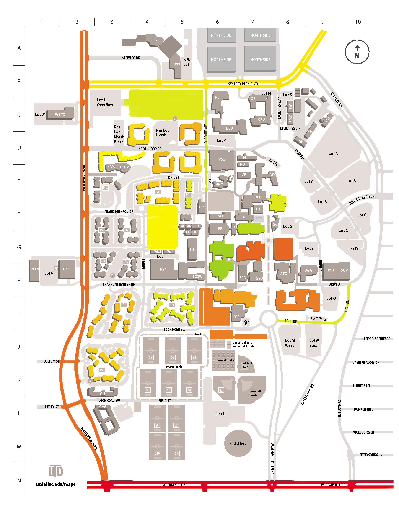
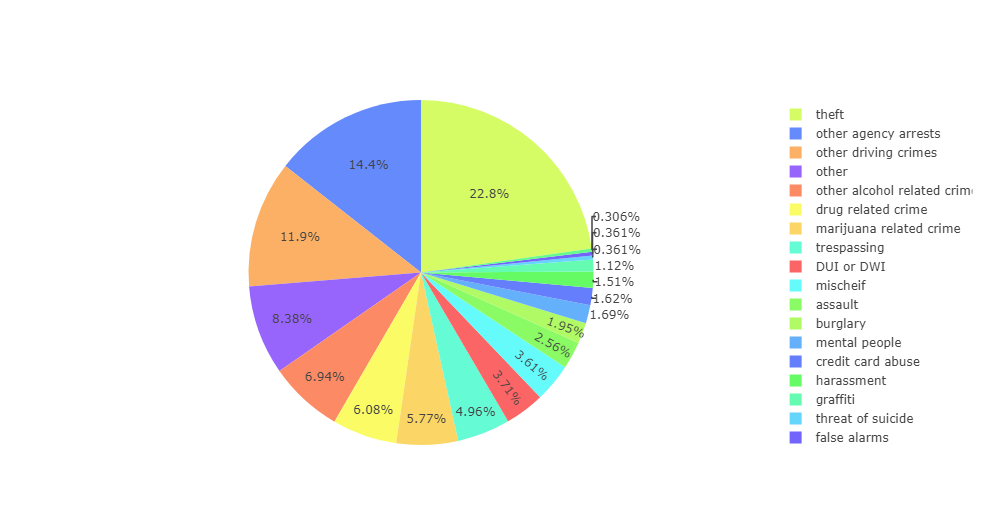
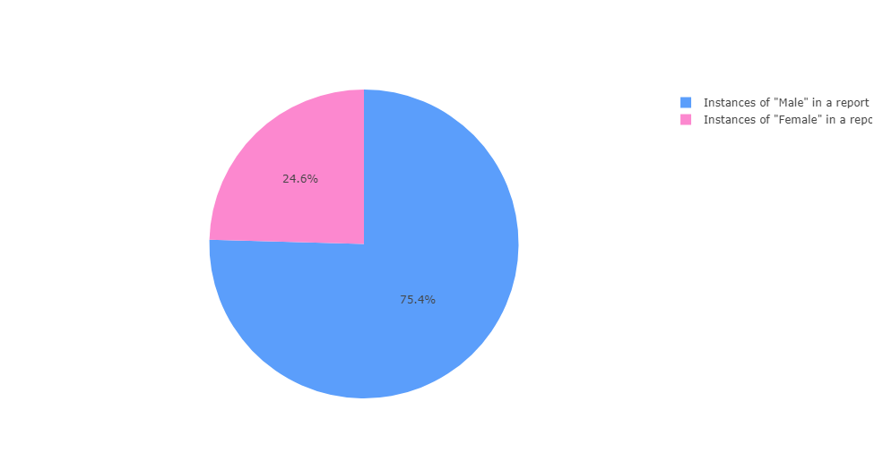
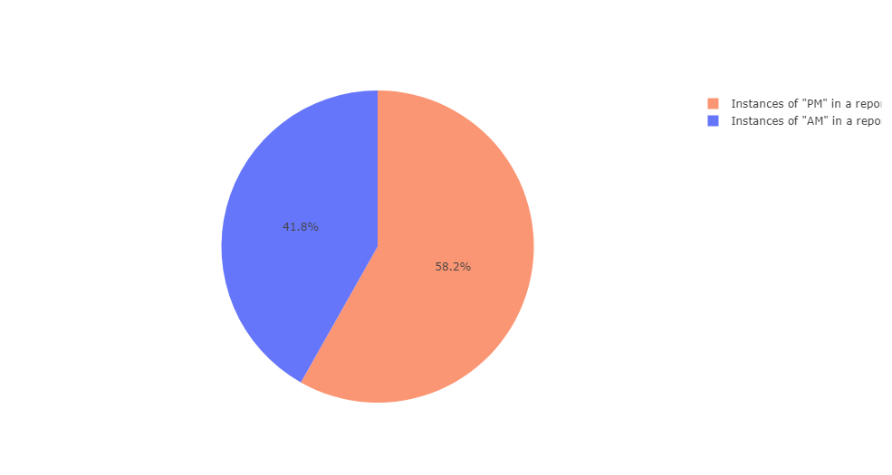

# UTD-Crime-Statistics
This is a python project that looks at the crime logs that can be found from UTD. The website I accessed the logs from was:

https://utdallas.edu/police/publicinfo.html

From all of these PDF files I was able to extract the data and create analysis on a lot of the different kind of information that we can find. 

## Notes
I use some keywords to help identify if a row belongs to a particular kind of crime. However, the officer (or other person) who makes the report on the PDF often misspells on some words and keywords. This makes it a little more difficult to be 100% accurate in our measurements, but it's really not that big of a deal. I just thought it was kind of interesting. 

I initially also wanted to make this project an interactive website but I did not have enough time to develop a full fledged website. Instead I was able to just generate some interesting analysis below.

### Simplified Heatmap of Crime Report Incidents.
This can be used as a kind of way to identify the areas where most crimes/crime reports occur. Beginning from red, we have the areas at UTD which have the most crime reports occuring, all the way to green which are lower reports and grey which indicates low to no reports. 

  

As you may be able to see, the roads are where most of the crimes are occurring. This can be for several reasons: students likely aren't the majority of people who are reporting the crimes. The crimes occurring here are likely the campus police catching students for speeding, or other driving related crimes. Also, the roads cover a large stretch of land with high density flow of traffic through them. This increases the chances of a person committing a crime in that area.

Note: anything below 45 incident reports were not colored in and are grey on the map.

### Categories of Crime Reported at UTD.

  

### Instances of "Male" versus "Female" in Reports.

  

### Instances of "PM" versus "AM" in Reports.
This refers to the time of day.

  

## Weird or Interesting Misc Things:

#### Incidents closed by ARREST: 2847
#### Incidents ASSIGNED: 642
#### Incidents INACTIVE: 1378

Times Misspelled "graffiti": 2

Times Misspelled "paraphernalia": 4

Times Misspelled "harass": 4

It's pretty funny that they made these spelling mistakes honestly, but I don't judge them. They've got a hard job, and their system probably doesn't have a spell-check. I wasn't even super sure myself how to spell 'paraphernalia'
